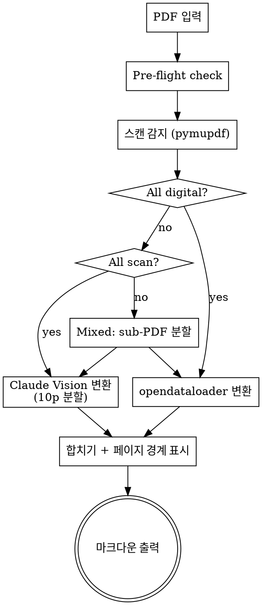

# PDF to Markdown Converter

PDF를 자동 분류하여 최적 경로로 마크다운 변환. 디지털 → opendataloader, 스캔 → Claude Vision.

## Process



## Step 1: Pre-flight Check

```bash
python -c "import pymupdf; print('pymupdf OK')"
```

pymupdf 없으면 → `pip install pymupdf` 안내 후 중단.

opendataloader 확인:
```bash
python -c "import opendataloader_pdf; print('opendataloader OK')" && java -version
```

opendataloader/Java 없으면 → 전체 Claude Vision 폴백 (사용자에게 안내).

## Step 2: Scan Detection

```bash
python -c "
import pymupdf
doc = pymupdf.open('INPUT.pdf')
scan_pages, digital_pages = [], []
for i in range(len(doc)):
    page = doc[i]
    blocks = [b for b in page.get_text('dict').get('blocks', []) if b['type'] == 0]
    text = page.get_text('text').strip()
    if len(blocks) < 3 and len(text) < 50:
        scan_pages.append(i + 1)
    else:
        digital_pages.append(i + 1)
total = len(doc)
print(f'Total: {total}p | Digital: {len(digital_pages)}p | Scan: {len(scan_pages)}p')
if scan_pages:
    print(f'Scan pages: {scan_pages}')
"
```

결과를 사용자에게 보고:
- "58p 전체 스캔본입니다. Claude Vision으로 처리합니다."
- "20p 디지털 PDF입니다. opendataloader로 처리합니다."
- "30p 중 5p 스캔, 25p 디지털입니다. 분할 처리합니다."

## Step 3A: Digital Path — opendataloader

```bash
python -c "
from opendataloader_pdf import convert
convert(input_path='INPUT.pdf', output_dir='OUTPUT_DIR', format='markdown')
print('Done')
"
```

Java PATH가 안 잡혀 있으면:
```bash
export PATH='/c/Program Files/Microsoft/jdk-21.0.10.7-hotspot/bin:$PATH'
```

## Step 3B: Scan Path — Claude Vision

**10페이지 분할 필수.** 20p 이상 한번에 읽으면 품질 저하.

**방법 1 (기본)**: Read 도구로 PDF 직접 읽기 (poppler 설치 필요)
```
Read 도구: pages "1-10" → 마크다운 변환 → Write
Read 도구: pages "11-20" → 마크다운 변환 → Write
...반복 → 모든 청크를 하나의 파일로 합치기
```

**방법 2 (폴백)**: poppler 없을 때 pymupdf로 PNG 렌더링 후 Read
```python
import pymupdf, os, tempfile
doc = pymupdf.open('INPUT.pdf')
tmpdir = os.path.join(tempfile.gettempdir(), 'pdf-vision')
os.makedirs(tmpdir, exist_ok=True)
for i in range(start_page, end_page):
    pix = doc[i].get_pixmap(dpi=200)
    pix.save(os.path.join(tmpdir, f'page_{i+1:03d}.png'))
```
→ 생성된 PNG를 Read 도구로 읽기 → 마크다운 변환

**poppler 설치** (Windows): `~/tools/poppler/` 에 설치됨. PATH 추가 필요:
```bash
export PATH="$HOME/tools/poppler/poppler-24.08.0/Library/bin:$PATH"
```

### Vision 변환 프롬프트

PDF를 Read한 후 다음 기준으로 마크다운 작성:
- 제목/소제목은 적절한 # 레벨
- 표는 마크다운 테이블
- 목록은 불릿/번호 리스트
- 원문의 구조와 내용을 정확히 보존
- 페이지 번호, 머리글/바닥글은 제외
- 각 10p 청크 사이에 `<!-- Page N-M -->` 경계 표시

### Content Filter 대응

방사선/레이저 경고, 독성 데이터에서 차단 발생 시:
1. 해당 섹션을 `[Content filtered - see original PDF page N]`으로 표기
2. 범위를 5p로 축소하여 재시도
3. 그래도 차단되면 해당 페이지 스킵하고 다음으로

### 대형 스캔 문서 (50p+)

서브에이전트로 병렬 분할:
- 20p씩 서브에이전트 할당 (각 서브에이전트 내에서 10p씩 Read)
- 각 서브에이전트가 별도 파일로 저장
- 완료 후 합치기
- 서브에이전트 완료 보고 시 **반드시 파일 존재 확인**

## Step 3C: Mixed PDF

1. pymupdf로 디지털 페이지만 포함한 sub-PDF 생성:
```python
import pymupdf
doc = pymupdf.open('INPUT.pdf')
digital_doc = pymupdf.open()
for p in digital_pages:
    digital_doc.insert_pdf(doc, from_page=p-1, to_page=p-1)
digital_doc.save('digital_part.pdf')
```

2. 디지털 sub-PDF → opendataloader
3. 스캔 페이지 → Claude Vision (원본 PDF에서 해당 페이지만 Read)
4. 페이지 순서대로 인터리빙하여 합치기

## Output

출력 파일에 포함:
- 마크다운 본문
- 페이지 경계: `<!-- Page N -->` 주석
- 처리 경로 표시: `<!-- Digital: opendataloader -->` 또는 `<!-- Scan: Claude Vision -->`
- 파일 상단 메타데이터:

```markdown
---
source: "파일명.pdf"
pages: N
digital_pages: N
scan_pages: N
method: opendataloader | claude-vision | mixed
converted: YYYY-MM-DD
---
```

## Quick Reference

| 상황 | 경로 | 속도 |
|------|------|------|
| 디지털 PDF | opendataloader | 0.05s/p |
| 스캔 PDF | Claude Vision | ~30s/10p |
| 혼합 PDF | 분할 → 각각 | varies |
| opendataloader 없음 | 전체 Claude Vision | ~30s/10p |

## Common Mistakes

- 스캔 PDF를 opendataloader에 넣으면 0바이트 출력
- 20p 이상 한번에 Read하면 품질 급락
- 서브에이전트 Write 후 파일 존재 확인 안 하면 누락 발생
- Java PATH 안 잡혀서 opendataloader 실패 → export PATH 필요
